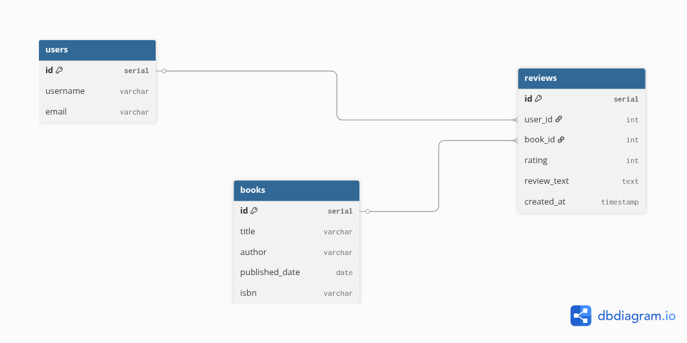

# Book Review Platform

A backend API built with **Django** and **PostgreSQL** that allows users to add books and reviews.  
This project demonstrates **REST API development, database modeling, ORM queries, and API documentation using Swagger**.

---


1. **Django project with REST APIs**  
   - Books: create, list, retrieve  
   - Reviews: add review (authenticated), list reviews (paginated, highest rating first)  
   - Analytics: top 3 books by rating, users with >5 reviews, most active reviewer  

2. **PostgreSQL migrations for schema**  
   - All models (`Book`, `Review`, `User`) migrated using Django migrations.  
   - `migrations/` folder included in repository.  

3. **README.md** (this file) contains:  
   - Database schema and design decisions  
   - API endpoints with request/response examples  
   - ORM queries used for analytics  
   - Setup and running instructions  
   - Swagger/OpenAPI documentation  

---

## 🛠️ Setup Instructions

1. **Clone the repository**
```bash
git clone <your-repo-url>
cd Book_Review_Platform


# Create and activate virtual environment
python -m venv env
source env/bin/activate 

## Install dependencies
pip install -r requirements.txt


Configure PostgreSQL database in settings.py

DATABASES = {
   'default': {
        'ENGINE': 'django.db.backends.postgresql',
        'NAME': 'book_review_db',
        'USER': 'book_user',
        'PASSWORD': 'strongpassword',
        'HOST': 'localhost',
        'PORT': '5432',
    }
}

## Run migrations
python manage.py migrate


##Run development server
python manage.py runserver


##Access API documentation
Swagger UI: http://127.0.0.1:8000/swagger/

## Database Schema Diagram

The following diagram represents the database structure and relationships
between User, Book, and Review models.

